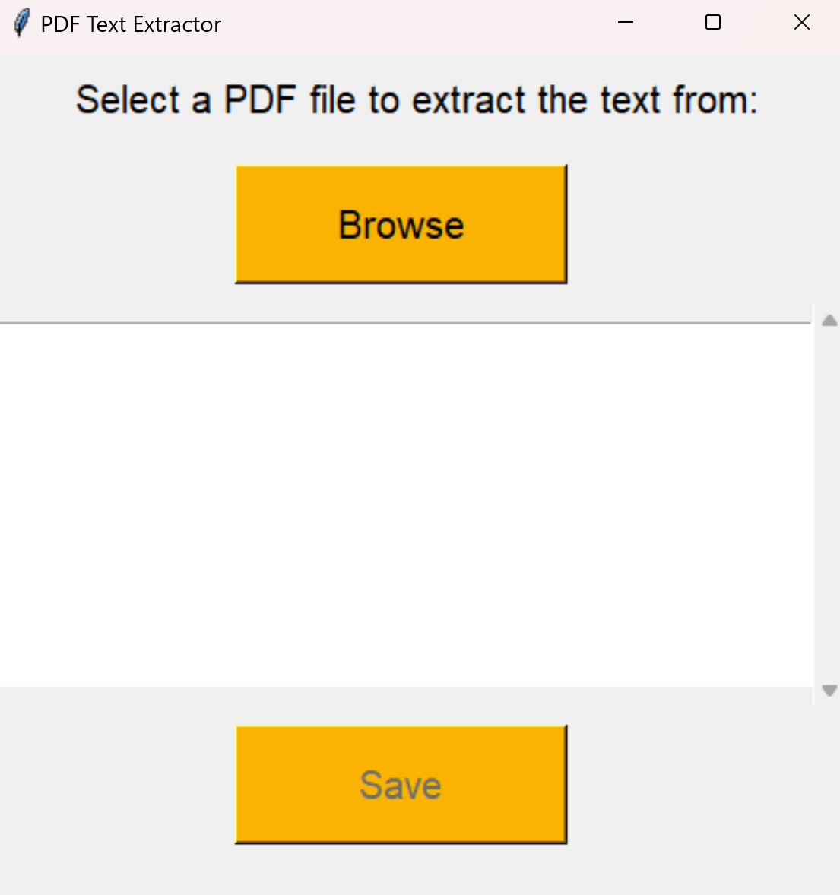

# PDF Text Extractor

Simple gui application with Tkinter that allows users to extract text from PDF files and save it to a .txt file using PyPDF2 for PDF file processing.



## Installation
1. Clone this repository:
    ```sh
    git clone https://github.com/sixthnovember/PDF-Text-Extractor.git
    cd PDF-Text-Extractor
    ```
2. Install the required packages:
    ```sh
    pip install -r requirements.txt
    ```
3. Run the application:
    ```sh
    python main.py
    ```

## Usage
1. Click the "Browse" button to select a PDF file.
2. The text of the PDF will be displayed in the text box.
3. To save the extracted text, click the "Save" button and choose the location and name for the .txt file.